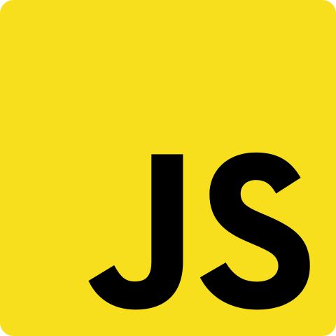

    
    <h1>Awesome Javascript</h1>
    
A great collection of small and big JavaScript project without the use of libraries

    <a href="https://markiesch.github.io/AwesomeJS" target="_blank">View Website</a>
    ·
    <a href="https://github.com/Markiesch/AwesomeJS/issues">Report Bug</a>
    ·
    <a href="https://github.com/Markiesch/AwesomeJS/issues">Request Feature</a>

 
 

## Contributing

Contributions are what make the open source community such an amazing place to learn, inspire, and create. Any contributions you make are **greatly appreciated**.

1. Fork the Project
2. Create a branch for your new project (`git checkout -b newproject`)
3. Commit your Changes (`git commit -m 'Added new project'`)
4. Push to the Branch (`git push origin newproject`)
5. Open a Pull Request
